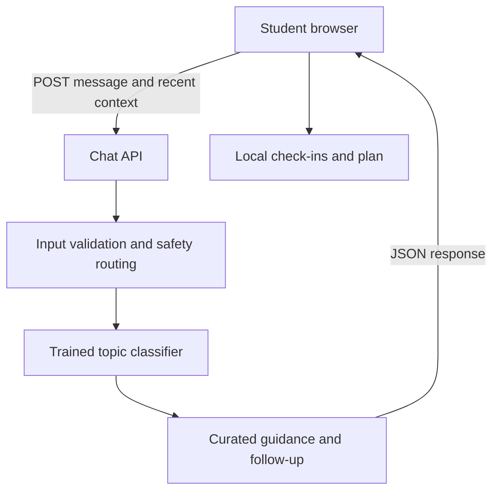

# Mental Health Consultant

An interactive **Mental Health Consultant** for college students, with Bowie State resources. It provides general wellness guidance, not clinical care.

**Link to website:** [Open Campus Calm](https://campus-calm-bsu.cedricrich74.chatgpt.site)

**GitHub repository:** [BSU-project](https://github.com/Cedjb2/BSU-project)

**Project identity:** Campus Calm BSU. This independent student project is not operated by Bowie State University.

## Clean repository layout

The repository root contains only **README.md** and **website/**. All application code, configuration, tests and resource documentation are grouped inside `website`. GitHub automatically displays this README beneath the file list. Keep its name `README.md` at the repository root.

| Location | Contents |
|---|---|
| [website/app](website/app/) | Website screens, styles and backend endpoints |
| [website/lib](website/lib/) | AI model, training examples, FAQ and Bowie resources |
| [website/components](website/components/) | Reusable interface components |
| [website/public](website/public/) | Website assets |
| [website/tests](website/tests/) | Automated checks |
| [website/docs](website/docs/) | Bowie State source and contact guide |
| `website/package.json` and other configuration | Dependencies, build and deployment settings |

The app requires several source files; grouping them under one folder keeps the front page tidy while preserving the working application.

## Run locally on Windows (optional)

For the hosted website, simply open the live link above. To edit and run the code locally:

1. Install Node.js 22.13 or newer from https://nodejs.org. Reopen your terminal afterward.
2. Open `campus-calm`, then open its **website** folder in File Explorer. Click its address bar, type `cmd`, and press Enter. Command Prompt opens in that folder.
3. Run:

```sh
npx --yes pnpm@11.25.0 install --frozen-lockfile
npx --yes pnpm@11.25.0 dev
```

Open the local address printed by the server, normally http://localhost:5173. Leave Command Prompt running. Press Ctrl+C to stop the server. Internet is needed for initial dependency installation. No AI API key is required. The app needs its server; opening an HTML file directly will not run it.

## Features

- AI-guided chat: 11 wellness topics, conversational follow-ups, goal selection, next-step buttons, loading states, retries and new conversations.
- Mood check-ins: mood, stress, optional reflection, browser persistence, history, deletion and export.
- Guided resets: timed breathing with start/pause/reset; an interactive five-step grounding exercise.
- Personal plan: add suggested or custom steps, complete/delete steps, export a text plan.
- FAQ: text search, category filters, expandable answers and links into chat.
- Bowie State support: nine searchable service cards, category filters, call/email/official-page links, and chat shortcuts.
- Bowie-specific FAQ: free counseling, location/hours, urgent support, freshman/peer support, accommodations and telecounseling.
- Human support: verified Bowie State contacts, official-campus-services search and U.S. 988/911 links.
- Privacy controls: export or erase local data, clear chat, explain data handling.
- Responsive layout, keyboard controls, labelled inputs, live status text, dialog focus trapping and reduced-motion styling.

All action controls perform real tasks. Informational headings and labels remain readable text.

## Meaningful AI integration

The backend runs a **multinomial Naive Bayes NLP classifier** trained on 132 original example messages across 11 topics. It tokenizes and normalizes language, learns word frequencies from labelled examples, calculates smoothed topic probabilities and chooses curated guidance. A user's goal and recent conversational context shape follow-ups. Low-confidence or unrelated messages trigger clarification.

This is machine-learning-based topic classification plus curated response selection. **It is not a generative large language model, licensed therapist, or clinically validated assessment.** It requires no API key and sends nothing to an external AI provider. Crisis wording has a separate rule-based routing layer; that layer is incomplete and does not assess safety.

Training data: `website/lib/ai/corpus.mjs`. Model and inference: `website/lib/ai/model.mjs`. Request validation: `website/app/api/chat/route.ts`.

## Technology stack and architecture

| Component | Technology | Purpose |
|---|---|---|
| User interface | React 19, TypeScript, CSS, Lucide icons | Interactive views and accessible controls |
| Full-stack framework | Vinext with Vite | React rendering and Next-style server routes |
| Backend | JavaScript HTTP routes | Validate input and run AI inference |
| AI | Original Naive Bayes classifier | Learn and predict college wellness topics |
| Storage | Browser localStorage | Optional device-local check-ins and plans |
| Hosting | Sites / Cloudflare Workers | Serve frontend and backend from one origin |
| Development assistant | ChatGPT / Codex | Design, code, debugging, tests and documentation |



Chat is held in the open tab. Saved check-ins and plans stay in this browser and are not sent with chat requests. Chat requests are processed by the app server without intentional application storage. Hosting services can process operational metadata. Avoid entering identifying or highly sensitive details. No claim of medical confidentiality or HIPAA compliance is made.

## Verify and build

Run these commands from the **website** folder:

```sh
npx --yes pnpm@11.25.0 test
npx --yes pnpm@11.25.0 typecheck
npx --yes pnpm@11.25.0 build
```

Thirteen automated tests cover classification, out-of-domain messages, contextual follow-ups, goal behavior, urgent support, diagnosis boundaries, text handling, request validation, body limits and correct Bowie service routing. A small illustrative evaluation matched 21 of 22 held-out examples; this is not a clinical or general accuracy estimate. Browser interaction and assistive-technology testing remain part of your pre-submission review.

## Deployment

The linked application is hosted with Sites and Cloudflare Workers. The project build produces client assets and the server Worker, including `/api/chat` and `/api/health`. Deployment packages the built output, publishes a saved version and verifies the returned status. The source archive includes the configuration and build helpers.

To redeploy through Sites, ask ChatGPT to update this Campus Calm BSU project. For an independent Cloudflare account, first run `pnpm build`, review `dist/server/wrangler.json`, then use Wrangler with your account to deploy the Worker and its assets. Account setup and secrets belong outside this repository. An unrelated hosting provider needs a compatible Worker or Vinext adapter; do not assume static hosting can serve server routes.

## Clean up your existing GitHub repository on Windows

You can keep your existing `Cedjb2/BSU-project` repository and its history. Node.js is not required for this cleanup.

1. Install [GitHub Desktop](https://desktop.github.com), open it and sign in.
2. Choose **File > Clone repository > URL**, enter `https://github.com/Cedjb2/BSU-project`, and click **Clone**. If you already have this repository locally, open that copy in Desktop and fetch/pull the latest changes instead.
3. Choose **Repository > Show in Explorer**. Enable hidden items: on Windows 11, **View > Show > Hidden items**; on Windows 10, **View > Hidden items**.
4. Create a folder named **website** inside the repository folder.
5. Select the existing project folders and files, including hidden configuration files, **except `.git`, `README.md`, and `website`**. Press **Ctrl+X**, open `website`, and press **Ctrl+V**. Keep `.git` at the repository root; it contains your Git history.
6. Download the cleaned `Campus-Calm-Source-Code.zip`, right-click it, choose **Extract All**, then open the extracted `campus-calm` folder. Copy its `README.md` into your local repository root, replacing the old README. Your existing code is now grouped under `website`; the download also supplies a complete clean copy of that folder.
7. Return to GitHub Desktop. Review **Changes**, enter **Organize website source and update README** in Summary, click **Commit to main**, then **Push origin**.
8. Choose **Repository > View on GitHub**. The root should show `website` and `README.md`, with the README displayed below the file list. Open `website` to browse the source. Files such as `.git` are local Git metadata and do not appear in the uploaded file list.

Do not upload the ZIP itself as a substitute for the extracted source. Do not place an extra `campus-calm` folder inside the repository.

## Upload the cleaned download to a new repository

If you are starting with a new repository rather than reorganizing your existing one:

1. Extract `Campus-Calm-Source-Code.zip` and open `campus-calm`. It contains **README.md** and **website**.
2. In GitHub Desktop choose **File > New repository**, select a name and local path, and leave **Initialize this repository with a README** unchecked. Leave Git ignore and license at **None**, then click **Create repository**.
3. Choose **Repository > Show in Explorer**. Copy the extracted **README.md** and **website** into this repository folder. Keep its `.git` folder.
4. In Desktop, review the changes, enter **Add Campus Calm website**, and click **Commit to main**.
5. Click **Publish repository**. For an instructor to view a public repository, uncheck **Keep this code private**, then publish.
6. Update the GitHub repository link near the top of this README if your new repository has a different URL. Commit and **Push origin**.

The application's `.gitignore` is inside `website` and excludes its dependencies, generated builds, environment files and runtime state. Run installation, development and build commands from **website**. The included `.openai/hosting.json` identifies the hosted project and is not an API credential. No AI API key is required.

GitHub stores your source; uploading code does not automatically deploy its backend. The live application is already hosted at the link above. GitHub Pages alone cannot execute this project's `/api/chat` server route.

Official instructions: [GitHub Desktop guide](https://docs.github.com/en/desktop/overview/creating-your-first-repository-using-github-desktop).

## Bowie State resources

The interactive directory includes Counseling Services, after-hours ProtoCall support, freshman/peer support, Henry Wise Wellness Center, Disability Support Services, LGBTQIA Resource Center, Academic Advisement, financial wellness guidance, and campus Public Safety. These support services have different roles; campus support is not a substitute for mental health treatment.

See [the source/contact guide](website/docs/BOWIE-STATE-RESOURCES.md) for official links and current verified details. Reviewed September 30, 2026. University pages can change or disagree about office details; confirm appointments and locations directly. This is an independent student project, not an official Bowie State service.

## Troubleshooting

- **“node” or “npm” is not recognized:** install Node.js, close the terminal and open it again.
- **“package.json not found”:** you are in the wrong folder. Open the **website** folder in Terminal/PowerShell; that is where `package.json` lives.
- **“pnpm” is not recognized:** run `npm install -g pnpm@11.25.0`. If global installation fails due to permissions, use `npx --yes pnpm@11.25.0 install --frozen-lockfile` and `npx --yes pnpm@11.25.0 dev` instead.
- **Port already in use:** open the alternative local address printed by the development server, or stop the earlier server with Control+C.
- **Chat fails after uploading to GitHub Pages:** this project needs a server for `/api/chat`. Use the provided live app URL or a compatible Cloudflare Worker deployment.
- **Local chat request fails:** leave the development terminal running and read its error output. Retry in the app after the server is ready.
- **No sound from phone links on a laptop:** call links hand off to a calling app if one is installed. The phone number is also visible so you can dial it yourself.

## Sources and content limits

Original wellness content is grounded in general guidance from:
- NIMH, Caring for Your Mental Health: https://www.nimh.nih.gov/health/topics/caring-for-your-mental-health
- SAMHSA, 988 Suicide & Crisis Lifeline: https://www.samhsa.gov/mental-health/988
- 988 Lifeline: https://988lifeline.org

Reviewed September 30, 2026. College counseling availability, cost and privacy policies vary; verify them with your institution. The app does not diagnose, prescribe, monitor emergencies or contact emergency services. Future production use would need broader model evaluation, security and privacy review, and qualified clinical review.
